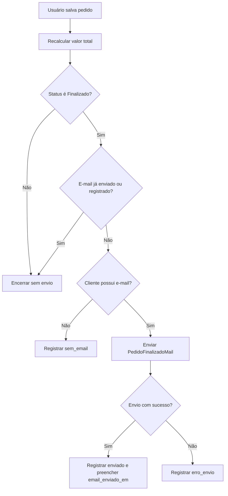

# Documentação Técnica - Sistema de Vendas e Pedidos

## Sumário

1. [Introdução](#1-introdução)
2. [Público-alvo](#2-público-alvo)
3. [Contexto do projeto](#3-contexto-do-projeto)
4. [Proposta](#4-proposta)
5. [Levantamento de requisitos](#5-levantamento-de-requisitos)
6. [Priorização MoSCoW](#6-priorização-moscow)
7. [Metodologia e prototipagem](#7-metodologia-e-prototipagem)
8. [Tecnologias utilizadas](#8-tecnologias-utilizadas)
9. [Arquitetura do sistema](#9-arquitetura-do-sistema)
10. [Banco de dados](#10-banco-de-dados)
11. [Rotas do sistema](#11-rotas-do-sistema)
12. [Segurança](#12-segurança)
13. [Permissões e controle de acesso](#13-permissões-e-controle-de-acesso)
14. [Módulos do sistema](#14-módulos-do-sistema)
15. [Envio de e-mail com Mailpit](#15-envio-de-e-mail-com-mailpit)
16. [Dashboard](#16-dashboard)
17. [Dados de teste](#17-dados-de-teste)
18. [Atalhos de login para teste](#18-atalhos-de-login-para-teste)
19. [Fluxos principais](#19-fluxos-principais)
20. [Instalação e configuração](#20-instalação-e-configuração)
21. [Considerações finais](#21-considerações-finais)

## 1. Introdução

O sistema é uma aplicação web administrativa desenvolvida em Laravel e Filament para gerenciamento de vendas, pedidos, clientes, fornecedores, usuários, cargos, permissões, produtos, estoque, insumos, envio de e-mails e acompanhamento de pedidos.

O painel principal fica em `/admin` e concentra os recursos administrativos do projeto. O Dashboard apresenta indicadores de pedidos e uma listagem visual dos últimos pedidos cadastrados.

## 2. Público-alvo

| Perfil | Finalidade no sistema |
| --- | --- |
| Administrador | Gerencia todos os módulos, usuários, cargos, permissões, vendas e estoque. |
| Gerente | Acompanha Dashboard, pedidos, clientes, produtos, estoque e Caixa de E-mail. |
| Vendedor | Cria e edita pedidos, visualiza dados necessários de clientes, produtos e estoque. |
| Usuário comum | Possui acesso limitado ao Dashboard. |
| Cliente | Existe como perfil de teste autenticável, com acesso limitado ao Dashboard. |
| Fornecedor | Existe como perfil de teste autenticável, com acesso limitado ao Dashboard. |

Clientes e fornecedores também existem como entidades de cadastro do sistema, em tabelas próprias (`clientes` e `fornecedors`). O usuário autenticável é registrado na tabela `users`.

## 3. Contexto do projeto

O sistema resolve necessidades administrativas de uma operação de vendas:

- Organização de pedidos e seus itens.
- Controle de clientes.
- Controle de fornecedores.
- Cadastro de produtos, estoque e insumos.
- Acompanhamento de status dos pedidos.
- Cálculo de valor total do pedido a partir dos produtos e quantidades.
- Envio de e-mail ao cliente quando o pedido é finalizado.
- Registro dos e-mails enviados ou com erro.
- Visualização de indicadores no Dashboard.
- Controle de acesso por cargos e permissões.

## 4. Proposta

A proposta técnica é usar Laravel como base de aplicação, Filament como painel administrativo e Spatie Permission como mecanismo de cargos/permissões.

A proposta funcional é centralizar a operação administrativa em módulos simples: cadastros gerais, vendas, estoque e permissões. O sistema permite criar pedidos com múltiplos produtos, calcular total, finalizar pedidos e acompanhar os registros de e-mail relacionados.

## 5. Levantamento de requisitos

### 5.1 Requisitos funcionais

| Código | Requisito |
| --- | --- |
| RF01 | O sistema deve permitir login de usuários no painel Filament. |
| RF02 | O sistema deve permitir cadastro de clientes. |
| RF03 | O sistema deve permitir cadastro de fornecedores. |
| RF04 | O sistema deve permitir cadastro de produtos. |
| RF05 | O sistema deve permitir controle de movimentações de estoque. |
| RF06 | O sistema deve permitir cadastro de insumos. |
| RF07 | O sistema deve permitir criação, visualização, edição e exclusão de pedidos conforme permissão. |
| RF08 | O sistema deve permitir adicionar produtos ao pedido por meio de itens. |
| RF09 | O sistema deve calcular o valor total do pedido. |
| RF10 | O sistema deve permitir alteração do status do pedido. |
| RF11 | O sistema deve enviar e-mail ao cliente quando o pedido for finalizado. |
| RF12 | O sistema deve registrar os e-mails de pedidos na tabela `emails_pedidos`. |
| RF13 | O sistema deve exibir uma Caixa de E-mail no grupo Vendas. |
| RF14 | O sistema deve exibir Dashboard com cards de resumo e últimos pedidos. |
| RF15 | O sistema deve permitir gerenciamento de usuários, cargos e permissões. |
| RF16 | O sistema deve criar dados fictícios por seeders para testes. |
| RF17 | O sistema deve exibir atalhos de login para teste em ambiente local com debug ativo. |

### 5.2 Requisitos não funcionais

| Código | Requisito |
| --- | --- |
| RNF01 | O sistema deve proteger senhas com hash. |
| RNF02 | O sistema deve possuir controle de acesso por cargos e permissões. |
| RNF03 | O painel deve ser responsivo. |
| RNF04 | Componentes customizados do Dashboard devem funcionar em tema claro e escuro. |
| RNF05 | O Dashboard deve manter boa organização visual. |
| RNF06 | O sistema deve evitar envio duplicado de e-mails de finalização. |
| RNF07 | Pedidos, itens e produtos devem manter relacionamentos consistentes. |
| RNF08 | O código deve ser organizado por Models, Resources, Widgets, Services, Mailables, migrations e seeders. |
| RNF09 | Os dados de teste devem poder ser recriados com `php artisan migrate:fresh --seed`. |

## 6. Priorização MoSCoW

| Prioridade | Itens |
| --- | --- |
| Must Have | Login, pedidos, clientes, produtos, estoque, envio de e-mail ao finalizar pedido, Dashboard com pedidos, cargos e permissões. |
| Should Have | Caixa de E-mail, atalhos de login para teste, cards de últimos pedidos compatíveis com tema claro/escuro, busca e filtros nas tabelas do Filament. |
| Could Have | Relatórios avançados, exportação de dados, métricas detalhadas, notificações internas adicionais. |
| Won't Have nesta etapa | Aplicativo mobile nativo, integração com pagamento real, integração com transportadora. |

## 7. Metodologia e prototipagem

O projeto segue uma evolução incremental:

- Criação dos recursos administrativos com Filament Resources.
- Organização das regras de acesso em um catálogo de permissões.
- Criação de seeders para visualizar fluxos reais.
- Ajuste visual do Dashboard a partir da visualização prática no navegador.
- Integração de e-mail com Mailpit para testes locais sem envio externo real.

O protótipo funcional está no próprio painel Filament, permitindo testar cadastros, pedidos, finalização e registros de e-mail.

## 8. Tecnologias utilizadas

Versões conferidas no projeto local por `composer show --direct` e `npm ls --depth=0`.

| Tecnologia | Versão local / configuração | Uso |
| --- | --- | --- |
| PHP | Requisito `^8.3` em `composer.json` | Linguagem principal. |
| Laravel Framework | 13.3.0 | Backend, rotas, migrations, seeders, autenticação e mail. |
| Filament | 5.4.1 | Painel administrativo. |
| Filament Widgets | 5.4.1 | Widgets do Dashboard. |
| Spatie Laravel Permission | 7.2.4 | Cargos e permissões. |
| Livewire | Usado pelo Filament | Componentes reativos do painel. |
| Tailwind CSS | 4.2.2 | Estilização via Vite e base visual do painel. |
| Vite | 8.0.5 | Build de assets frontend. |
| Laravel Vite Plugin | 3.0.1 | Integração Laravel/Vite. |
| Axios | 1.14.0 | Dependência frontend disponível. |
| Faker | 1.24.1 | Geração de dados fictícios em ambiente de teste. |
| PHPUnit | 12.5.14 | Testes automatizados. |
| Mailpit | Configurado por SMTP local | Captura de e-mails em desenvolvimento. |
| Banco de dados | `.env.example` usa SQLite | Pode ser ajustado no `.env` conforme ambiente. |

## 9. Arquitetura do sistema

### 9.1 Camadas principais

| Camada | Arquivos / diretórios | Responsabilidade |
| --- | --- | --- |
| Models | `app/Models` | Representam tabelas e relacionamentos Eloquent. |
| Filament Resources | `app/Filament/Resources` | Telas administrativas de CRUD. |
| Pages | `app/Filament/Resources/*/Pages` | Páginas de listagem, criação, edição e visualização. |
| Widgets | `app/Filament/Widgets` | Componentes do Dashboard. |
| Services | `app/Services/PedidoEmailService.php` | Regra de envio e registro de e-mail de pedido finalizado. |
| Mailables | `app/Mail/PedidoFinalizadoMail.php` | Construção do e-mail enviado ao cliente. |
| Views Blade | `resources/views` | Layouts de e-mail e widget customizado. |
| Migrations | `database/migrations` | Estrutura do banco de dados. |
| Seeders | `database/seeders` | Dados fictícios e permissões iniciais. |
| Suporte | `app/Support` | Catálogo de permissões e verificação de acesso. |

### 9.2 Arquivos centrais

| Arquivo | Função |
| --- | --- |
| `app/Providers/Filament/AdminPanelProvider.php` | Configura painel `/admin`, login customizado, cor primária violeta, descoberta de resources, pages e widgets. |
| `app/Filament/Pages/Auth/Login.php` | Personaliza login e exibe atalhos de teste em ambiente local. |
| `app/Support/PermissionCatalog.php` | Define permissões e permissões por cargo. |
| `app/Support/FilamentAccess.php` | Centraliza checagem de acesso usada pelos Resources e Widgets. |
| `app/Services/PedidoEmailService.php` | Envia e registra e-mails de finalização. |

## 10. Banco de dados

### 10.1 Tabelas principais

#### `users`

| Coluna | Tipo | Restrições / finalidade |
| --- | --- | --- |
| `id` | big integer | Chave primária. |
| `name` | string | Nome do usuário. |
| `email` | string | Único, usado para login. |
| `email_verified_at` | timestamp nullable | Verificação de e-mail. |
| `password` | string | Senha com hash. |
| `remember_token` | string nullable | Token de lembrar login. |
| `created_at`, `updated_at` | timestamps | Controle de criação e atualização. |

#### `clientes`

| Coluna | Tipo | Restrições / finalidade |
| --- | --- | --- |
| `id` | big integer | Chave primária. |
| `nome` | string | Nome do cliente. |
| `email` | string nullable | E-mail do cliente. |
| `telefone` | string nullable | Telefone ou WhatsApp. |
| `documento` | string nullable | CPF ou CNPJ. |
| `created_at`, `updated_at` | timestamps | Controle de criação e atualização. |

#### `fornecedors`

| Coluna | Tipo | Restrições / finalidade |
| --- | --- | --- |
| `id` | big integer | Chave primária. |
| `empresa` | string | Nome da empresa fornecedora. |
| `documento` | string nullable | CNPJ. |
| `endereco` | string | Endereço do fornecedor. |
| `telefone` | string nullable | Telefone. |
| `created_at`, `updated_at` | timestamps | Controle de criação e atualização. |

#### `produtos`

| Coluna | Tipo | Restrições / finalidade |
| --- | --- | --- |
| `id` | big integer | Chave primária. |
| `nome` | string | Nome do produto. |
| `referencia` | string nullable | Código ou referência. |
| `preco_venda` | decimal(10,2) nullable | Preço de venda. |
| `estoque` | integer default 0 | Quantidade em estoque. |
| `created_at`, `updated_at` | timestamps | Controle de criação e atualização. |

#### `insumos`

| Coluna | Tipo | Restrições / finalidade |
| --- | --- | --- |
| `id` | big integer | Chave primária. |
| `nome` | string | Nome do insumo. |
| `unidade_medida` | string | Unidade, como kg, metro ou unidade. |
| `preco_custo` | decimal(10,2) nullable | Preço de custo. |
| `estoque` | decimal(10,2) default 0 | Quantidade em estoque. |
| `created_at`, `updated_at` | timestamps | Controle de criação e atualização. |

#### `pedidos`

| Coluna | Tipo | Restrições / finalidade |
| --- | --- | --- |
| `id` | big integer | Chave primária. |
| `cliente_id` | foreign id | Obrigatório, referencia `clientes`, exclusão em cascata. |
| `status` | string default `Pendente` | Status do pedido. |
| `valor_total` | decimal(10,2) nullable | Total calculado a partir dos itens. |
| `email_enviado_em` | timestamp nullable | Marca quando o e-mail de finalização foi enviado. |
| `created_at`, `updated_at` | timestamps | Controle de criação e atualização. |

Status reais do pedido no código:

- `Pendente`
- `Em Produção`
- `Finalizado`
- `Cancelado`

#### `item_pedidos`

| Coluna | Tipo | Restrições / finalidade |
| --- | --- | --- |
| `id` | big integer | Chave primária. |
| `pedido_id` | foreign id | Obrigatório, referencia `pedidos`, exclusão em cascata. |
| `produto_id` | foreign id | Obrigatório, referencia `produtos`, exclusão em cascata. |
| `quantidade` | integer | Quantidade do produto no pedido. |
| `preco_unitario` | decimal(10,2) | Preço unitário registrado no item. |
| `created_at`, `updated_at` | timestamps | Controle de criação e atualização. |

O subtotal não é coluna da tabela. Ele é calculado no accessor `ItemPedido::getSubtotalAttribute()`.

#### `estoques`

| Coluna | Tipo | Restrições / finalidade |
| --- | --- | --- |
| `id` | big integer | Chave primária. |
| `produto_id` | foreign id | Obrigatório, referencia `produtos`, exclusão em cascata. |
| `quantidade` | integer | Quantidade movimentada. |
| `tipo_movimentacao` | string default `saida` | Tipo da movimentação: `entrada` ou `saida`. |
| `observacao` | string nullable | Observação da movimentação. |
| `created_at`, `updated_at` | timestamps | Controle de criação e atualização. |

#### `emails_pedidos`

| Coluna | Tipo | Restrições / finalidade |
| --- | --- | --- |
| `id` | big integer | Chave primária. |
| `pedido_id` | foreign id | Obrigatório, referencia `pedidos`, exclusão em cascata. |
| `cliente_id` | foreign id nullable | Referencia `clientes`, fica nulo se cliente for removido. |
| `email_destinatario` | string nullable | Destinatário usado no envio. |
| `assunto` | string | Assunto do e-mail. |
| `status_envio` | string default `pendente` | Situação do envio. |
| `enviado_em` | timestamp nullable | Data e hora do envio. |
| `conteudo_resumo` | text nullable | Resumo do conteúdo enviado. |
| `erro_envio` | text nullable | Mensagem de erro quando houver falha. |
| `created_at`, `updated_at` | timestamps | Controle de criação e atualização. |

Status reais de e-mail no código:

- `pendente`
- `enviado`
- `sem_email`
- `erro`

#### Tabelas do Spatie Permission

| Tabela | Finalidade |
| --- | --- |
| `permissions` | Permissões técnicas do sistema. |
| `roles` | Cargos/perfis de acesso. |
| `model_has_permissions` | Permissões diretas atribuídas a modelos, como usuários. |
| `model_has_roles` | Cargos atribuídos a modelos, como usuários. |
| `role_has_permissions` | Permissões vinculadas a cargos. |

#### Tabelas padrão do Laravel

| Tabela | Finalidade |
| --- | --- |
| `password_reset_tokens` | Tokens para redefinição de senha. |
| `sessions` | Sessões quando `SESSION_DRIVER=database`. |
| `cache`, `cache_locks` | Cache e locks quando `CACHE_STORE=database`. |
| `jobs`, `job_batches`, `failed_jobs` | Filas e jobs quando `QUEUE_CONNECTION=database`. |

### 10.2 Relacionamentos

| Relacionamento | Implementação |
| --- | --- |
| Cliente possui muitos pedidos | `Cliente::pedidos()` |
| Cliente possui muitos registros de e-mail | `Cliente::emailsPedidos()` |
| Pedido pertence a cliente | `Pedido::cliente()` |
| Pedido possui muitos itens | `Pedido::itens()` |
| Pedido possui muitos registros de e-mail | `Pedido::emailsPedidos()` |
| Item de pedido pertence a pedido | `ItemPedido::pedido()` |
| Item de pedido pertence a produto | `ItemPedido::produto()` |
| Produto possui muitos itens de pedido | `Produto::itensPedido()` |
| Estoque pertence a produto | `Estoque::produto()` |
| E-mail de pedido pertence a pedido | `EmailPedido::pedido()` |
| E-mail de pedido pertence a cliente | `EmailPedido::cliente()` |
| Usuário possui cargos e permissões | Trait `HasRoles` do Spatie Permission em `User`. |

## 11. Rotas do sistema

O painel Filament é configurado com path `/admin` em `AdminPanelProvider`.

| Rota | Módulo / finalidade |
| --- | --- |
| `/` | Rota padrão que retorna a view `welcome`. |
| `/admin/login` | Login customizado do painel Filament. |
| `/admin` | Dashboard do Filament. |
| `/admin/pedidos` | Listagem de pedidos. |
| `/admin/pedidos/create` | Criação de pedido. |
| `/admin/pedidos/{record}` | Visualização de pedido. |
| `/admin/pedidos/{record}/edit` | Edição de pedido. |
| `/admin/caixa-de-email` | Caixa de E-mail. |
| `/admin/caixa-de-email/{record}` | Visualização de registro de e-mail. |
| `/admin/clientes` | Listagem de clientes. |
| `/admin/clientes/create` | Criação de cliente. |
| `/admin/clientes/{record}` | Visualização de cliente. |
| `/admin/clientes/{record}/edit` | Edição de cliente. |
| `/admin/fornecedors` | Listagem de fornecedores. |
| `/admin/fornecedors/create` | Criação de fornecedor. |
| `/admin/fornecedors/{record}` | Visualização de fornecedor. |
| `/admin/fornecedors/{record}/edit` | Edição de fornecedor. |
| `/admin/produtos` | Listagem de produtos. |
| `/admin/produtos/create` | Criação de produto. |
| `/admin/produtos/{record}` | Visualização de produto. |
| `/admin/produtos/{record}/edit` | Edição de produto. |
| `/admin/estoques` | Listagem de movimentações de estoque. |
| `/admin/estoques/create` | Criação de movimentação de estoque. |
| `/admin/estoques/{record}` | Visualização de movimentação. |
| `/admin/estoques/{record}/edit` | Edição de movimentação. |
| `/admin/insumos` | Listagem de insumos. |
| `/admin/insumos/create` | Criação de insumo. |
| `/admin/insumos/{record}` | Visualização de insumo. |
| `/admin/insumos/{record}/edit` | Edição de insumo. |
| `/admin/users` | Usuários. |
| `/admin/roles` | Cargos. |
| `/admin/permissions` | Permissões. |

As rotas administrativas são geradas pelos Resources do Filament e protegidas pelos middlewares do painel.

## 12. Segurança

| Recurso | Implementação |
| --- | --- |
| Autenticação | Painel Filament com `Authenticate` no `AdminPanelProvider`. |
| Sessão autenticada | Middlewares `StartSession`, `AuthenticateSession` e `ShareErrorsFromSession`. |
| CSRF | Middleware `PreventRequestForgery`. |
| Hash de senha | `User` possui cast `password => hashed`; seeders usam `Hash::make('password')`. |
| Controle de acesso | Resources e Widgets chamam `FilamentAccess::canAny()`. |
| Cargos e permissões | Spatie Permission com `HasRoles` em `User`. |
| Atalhos de login | Exibidos apenas se `APP_ENV=local` e `APP_DEBUG=true`. |
| Evitar e-mail duplicado | `PedidoEmailService` ignora pedido não finalizado, pedido com `email_enviado_em` preenchido ou pedido com registro `enviado`/`sem_email`. |
| Exclusão consistente | Chaves estrangeiras usam `cascadeOnDelete` nos vínculos principais de pedidos, itens e estoque. |

## 13. Permissões e controle de acesso

As permissões ficam centralizadas em `app/Support/PermissionCatalog.php`.

### 13.1 Permissões cadastradas

| Módulo | Permissões |
| --- | --- |
| Dashboard | `dashboard.visualizar` |
| Cadastros Gerais | `clientes.gerenciar`, `fornecedores.gerenciar`, `usuarios.gerenciar` |
| Vendas | `pedidos.gerenciar`, `pedidos.criar`, `pedidos.editar`, `caixa_email.visualizar` |
| Estoques | `produtos.gerenciar`, `insumos.gerenciar`, `estoque.gerenciar`, `estoque.visualizar` |
| Permissões | `cargos.gerenciar`, `permissoes.gerenciar` |

### 13.2 Cargos configurados

| Cargo | Acesso |
| --- | --- |
| Administrador | Todas as permissões do catálogo. Também possui acesso total pelo fallback de `FilamentAccess` para cargos `Administrador` ou `Admin`. |
| Gerente | Dashboard, clientes, pedidos, criação/edição de pedidos, Caixa de E-mail, produtos e visualização de estoque. |
| Vendedor | Dashboard, clientes, criação/edição de pedidos, produtos e visualização de estoque. |
| Usuário comum | Dashboard. |
| Cliente | Dashboard. |
| Fornecedor | Dashboard. |

Usuários também podem receber permissões adicionais diretamente no módulo Usuários, mas o uso recomendado no próprio formulário é controlar o acesso pelos cargos.

## 14. Módulos do sistema

### 14.1 Dashboard

| Item | Descrição |
| --- | --- |
| Arquivos | `PedidosOverviewWidget.php`, `PedidosRecentesWidget.php`, `pedidos-recentes-widget.blade.php`. |
| Objetivo | Exibir resumo de pedidos e últimos pedidos. |
| Informações | Total de pedidos, finalizados, em produção, pendentes, valor vendido e cards recentes. |
| Observação | O gráfico de pizza "Pedidos por status" foi removido. |

### 14.2 Clientes

| Item | Descrição |
| --- | --- |
| Resource | `app/Filament/Resources/Clientes/ClienteResource.php` |
| Model | `App\Models\Cliente` |
| Campos | Nome, e-mail, telefone e documento. |
| Ações | Listar, criar, visualizar, editar e excluir conforme permissão `clientes.gerenciar`. |

### 14.3 Fornecedores

| Item | Descrição |
| --- | --- |
| Resource | `app/Filament/Resources/Fornecedors/FornecedorResource.php` |
| Model | `App\Models\Fornecedor` |
| Campos | Empresa, documento, endereço e telefone. |
| Ações | Listar, criar, visualizar, editar e excluir conforme permissão `fornecedores.gerenciar`. |

### 14.4 Usuários

| Item | Descrição |
| --- | --- |
| Resource | `app/Filament/Resources/Users/UserResource.php` |
| Model | `App\Models\User` |
| Campos | Nome, e-mail, senha, cargos e permissões adicionais. |
| Ações | Gerenciamento conforme permissão `usuarios.gerenciar`. |

### 14.5 Cargos

| Item | Descrição |
| --- | --- |
| Resource | `app/Filament/Resources/Roles/RoleResource.php` |
| Model | `Spatie\Permission\Models\Role` |
| Campos | Nome do cargo, guard e permissões. |
| Ações | Gerenciamento conforme permissão `cargos.gerenciar`. |

### 14.6 Permissões

| Item | Descrição |
| --- | --- |
| Resource | `app/Filament/Resources/Permissions/PermissionResource.php` |
| Model | `Spatie\Permission\Models\Permission` |
| Campos | Permissão e guard. |
| Ações | Gerenciamento conforme permissão `permissoes.gerenciar`. |

### 14.7 Pedidos

| Item | Descrição |
| --- | --- |
| Resource | `app/Filament/Resources/Pedidos/PedidoResource.php` |
| Model | `App\Models\Pedido` |
| Campos | Cliente, status, valor total e itens do pedido. |
| Itens | Produto, quantidade e preço unitário. |
| Regras | Valor total é calculado pelos itens; finalização chama o serviço de e-mail. |
| Permissões | `pedidos.gerenciar`, `pedidos.criar`, `pedidos.editar`. |

### 14.8 Caixa de E-mail

| Item | Descrição |
| --- | --- |
| Resource | `app/Filament/Resources/EmailsPedidos/EmailPedidoResource.php` |
| Model | `App\Models\EmailPedido` |
| Campos | Pedido, cliente, destinatário, assunto, status, data de envio, conteúdo e erro. |
| Ações | Listar e visualizar; criação manual desativada. |
| Permissão | `caixa_email.visualizar`. |

### 14.9 Produtos

| Item | Descrição |
| --- | --- |
| Resource | `app/Filament/Resources/Produtos/ProdutoResource.php` |
| Model | `App\Models\Produto` |
| Campos | Nome, referência, preço de venda e estoque. |
| Permissões | Gerenciamento por `produtos.gerenciar`; visualização também por `estoque.visualizar`. |

### 14.10 Estoque

| Item | Descrição |
| --- | --- |
| Resource | `app/Filament/Resources/Estoques/EstoqueResource.php` |
| Model | `App\Models\Estoque` |
| Campos | Produto, quantidade, tipo de movimentação e observação. |
| Tipos | `entrada` e `saida`. |
| Permissões | `estoque.gerenciar` e `estoque.visualizar`. |

### 14.11 Insumos

| Item | Descrição |
| --- | --- |
| Resource | `app/Filament/Resources/Insumos/InsumoResource.php` |
| Model | `App\Models\Insumo` |
| Campos | Nome, unidade de medida, preço de custo e estoque. |
| Permissão | `insumos.gerenciar`. |

## 15. Envio de e-mail com Mailpit

### 15.1 Configuração

O projeto está configurado para SMTP local:

```env
MAIL_MAILER=smtp
MAIL_HOST=127.0.0.1
MAIL_PORT=1025
MAIL_USERNAME=null
MAIL_PASSWORD=null
MAIL_ENCRYPTION=null
MAIL_FROM_ADDRESS="sistema@meusistema.com"
MAIL_FROM_NAME="${APP_NAME}"
```

### 15.2 Arquivos responsáveis

| Arquivo | Função |
| --- | --- |
| `app/Mail/PedidoFinalizadoMail.php` | Define assunto e view do e-mail. |
| `resources/views/emails/pedidos/finalizado.blade.php` | Template HTML do e-mail. |
| `app/Services/PedidoEmailService.php` | Envia, registra status e evita duplicidade. |
| `app/Models/EmailPedido.php` | Model dos registros de e-mail. |
| `app/Filament/Resources/EmailsPedidos/EmailPedidoResource.php` | Caixa de E-mail no painel. |

### 15.3 Quando o e-mail é enviado

Após salvar um pedido, o fluxo em `HandlesPedidoAfterSave` recalcula o total do pedido e chama `PedidoEmailService::enviarFinalizacao()`. O serviço só envia quando:

- O pedido está com status `Finalizado`.
- O campo `email_enviado_em` ainda não foi preenchido.
- Não existe registro anterior com status `enviado` ou `sem_email`.
- O cliente possui e-mail cadastrado.

Se o cliente não possuir e-mail, o sistema registra o caso com status `sem_email`. Se o envio falhar, registra status `erro` e salva a mensagem em `erro_envio`.

### 15.4 Como testar no Mailpit

1. Inicie o Mailpit na máquina local.
2. Confirme que ele está escutando SMTP em `127.0.0.1:1025`.
3. Acesse a interface web do Mailpit, normalmente em `http://127.0.0.1:8025`.
4. No painel, crie ou edite um pedido com cliente que possua e-mail.
5. Altere o status para `Finalizado` e salve.
6. Confira o e-mail capturado no Mailpit e o registro em `/admin/caixa-de-email`.

## 16. Dashboard

### 16.1 Widgets ativos

| Widget | Arquivo | Conteúdo |
| --- | --- | --- |
| Resumo de vendas | `app/Filament/Widgets/PedidosOverviewWidget.php` | Total de pedidos, finalizados, em produção, pendentes e valor total vendido. |
| Últimos pedidos | `app/Filament/Widgets/PedidosRecentesWidget.php` | Busca os 8 pedidos mais recentes por `updated_at`. |

### 16.2 Últimos pedidos

Cada card exibe:

- ID do pedido.
- Nome do cliente.
- Status em badge.
- Valor total.
- Quantidade de produtos.
- Data de atualização.
- Botão para editar ou visualizar pedido, conforme permissão do usuário.

A view customizada fica em `resources/views/filament/widgets/pedidos-recentes-widget.blade.php`. Ela possui estilos compatíveis com tema claro e escuro, evitando fundo branco puro no dark mode.

### 16.3 Remoção do gráfico de pizza

O widget do gráfico de pizza "Pedidos por status" foi removido. O Dashboard agora foca em cards de resumo e listagem visual dos últimos pedidos.

## 17. Dados de teste

### 17.1 Seeders configurados

O `DatabaseSeeder` chama:

1. `RolesAndPermissionsSeeder`
2. `UserSeeder`
3. `ClienteSeeder`
4. `FornecedorSeeder`
5. `ProdutoSeeder`
6. `PedidoSeeder`
7. `EmailPedidoSeeder`

### 17.2 Conteúdo gerado

| Seeder | Dados |
| --- | --- |
| `RolesAndPermissionsSeeder` | Permissões técnicas e cargos. |
| `UserSeeder` | Usuários de teste com senha `password`. |
| `ClienteSeeder` | Clientes fictícios com e-mail, telefone e documento. |
| `FornecedorSeeder` | Fornecedores fictícios. |
| `ProdutoSeeder` | Produtos fictícios com referência, preço e estoque. |
| `PedidoSeeder` | Pedidos com status variados e itens vinculados. |
| `EmailPedidoSeeder` | Registros de e-mail para pedidos finalizados. |

### 17.3 Usuários de teste

| Perfil | E-mail | Senha |
| --- | --- | --- |
| Administrador | `admin@sistema.com` | `password` |
| Gerente | `gerente@sistema.com` | `password` |
| Vendedor | `vendedor@sistema.com` | `password` |
| Usuário comum | `usuario@sistema.com` | `password` |
| Cliente | `cliente@sistema.com` | `password` |
| Fornecedor | `fornecedor@sistema.com` | `password` |

Os perfis Cliente e Fornecedor existem como usuários autenticáveis de teste, mas o acesso deles é limitado ao Dashboard pelo catálogo de permissões atual.

## 18. Atalhos de login para teste

Os atalhos ficam na página customizada `app/Filament/Pages/Auth/Login.php`.

Eles aparecem somente quando:

- `APP_ENV=local`
- `APP_DEBUG=true`

Perfis exibidos nos atalhos:

| Atalho | E-mail preenchido | Senha preenchida |
| --- | --- | --- |
| Administrador | `admin@sistema.com` | `password` |
| Cliente | `cliente@sistema.com` | `password` |
| Fornecedor | `fornecedor@sistema.com` | `password` |

Ao clicar em um atalho, o método `fillTestLogin()` preenche o formulário de login com e-mail e senha. O envio do formulário continua sendo feito pelo usuário.

## 19. Fluxos principais

### 19.1 Fluxo de pedido finalizado



### 19.2 Fluxo de acesso ao painel

```mermaid
flowchart TD
    A[Acessar /admin] --> B{Usuário autenticado?}
    B -- Não --> C[/admin/login]
    B -- Sim --> D[Dashboard]
    D --> E{Possui permissão do módulo?}
    E -- Sim --> F[Exibir Resource ou Widget]
    E -- Não --> G[Ocultar ou negar acesso]
```

## 20. Instalação e configuração

### 20.1 Passo a passo

```bash
composer install
npm install
copy .env.example .env
php artisan key:generate
php artisan migrate:fresh --seed
npm run dev
php artisan serve
```

No Windows PowerShell, se preferir:

```powershell
Copy-Item .env.example .env
```

### 20.2 Banco de dados

O `.env.example` atual usa SQLite:

```env
DB_CONNECTION=sqlite
```

Para usar MySQL ou outro banco, ajuste `DB_CONNECTION`, `DB_HOST`, `DB_PORT`, `DB_DATABASE`, `DB_USERNAME` e `DB_PASSWORD` no `.env` antes de rodar as migrations.

### 20.3 Popular dados de teste

```bash
php artisan migrate:fresh --seed
```

Esse comando recria o banco e popula usuários, clientes, fornecedores, produtos, pedidos, itens de pedidos, registros de e-mail, cargos e permissões.

### 20.4 Mailpit

Inicie o Mailpit antes de testar envio real de e-mail:

```bash
mailpit
```

Depois acesse a interface web do Mailpit, normalmente em:

```text
http://127.0.0.1:8025
```

## 21. Considerações finais

O sistema atual possui um painel administrativo funcional em Laravel e Filament, com módulos de vendas, cadastros, estoque, permissões, Caixa de E-mail, Dashboard e dados fictícios para validação.

As principais melhorias futuras possíveis são relatórios avançados, exportação de dados, métricas adicionais, notificações internas e integrações externas de pagamento ou entrega, caso essas necessidades entrem no escopo do projeto.
